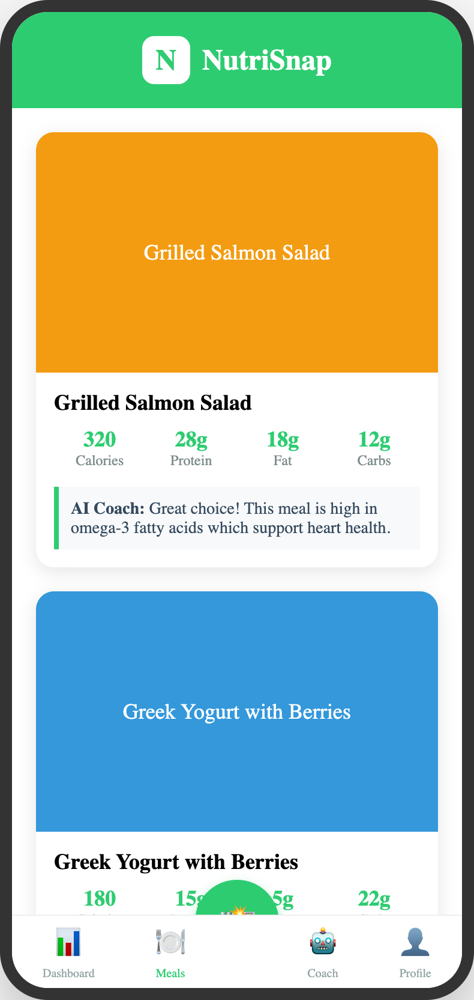

# NutriSnap Landing Page

A modern, engaging landing page for the NutriSnap mobile application, built with Astro.



## ✨ Features

- **Modern Design**: Utilizes glassmorphism, subtle animations, and a vibrant color scheme
- **Responsive Layout**: Optimized for all device sizes
- **App Showcase**: Custom app mockups demonstrating key features
- **Download CTAs**: Strategically placed download buttons throughout the page

## 📱 About NutriSnap

NutriSnap is a mobile application that helps users track their nutrition through:

- **AI-Powered Food Recognition**: Snap a photo of your meal for instant nutritional analysis
- **Detailed Nutrition Tracking**: Get comprehensive breakdowns of macros and micronutrients
- **Personalized AI Coaching**: Receive tailored nutrition advice and meal recommendations

## 🚀 Technology Stack

- **Framework**: [Astro](https://astro.build/)
- **Styling**: Custom CSS with variables for theming
- **Mockups**: Custom HTML/CSS mockups converted to images

## 📝 Project Structure

```text
/
├── public/
│   └── images/             # App mockups and badges
├── src/
│   ├── components/
│   │   └── Welcome.astro   # Main landing page component
│   ├── layouts/
│   │   └── Layout.astro    # Base layout template
│   └── pages/
│       └── index.astro     # Main entry point
└── package.json
```

## 🧞 Commands

All commands are run from the root of the project, from a terminal:

| Command                   | Action                                           |
| :------------------------ | :----------------------------------------------- |
| `npm install`             | Installs dependencies                            |
| `npm run dev`             | Starts local dev server at `localhost:4321`      |
| `npm run build`           | Build your production site to `./dist/`          |
| `npm run preview`         | Preview your build locally, before deploying     |
| `npm run astro ...`       | Run CLI commands like `astro add`, `astro check` |
| `npm run astro -- --help` | Get help using the Astro CLI                     |

## 🎨 Design Elements

- **Color Scheme**:
  - Primary: #2ecc71 (NutriSnap Green)
  - Secondary: #3498db (Bright Blue)
  - Accent: #f39c12 (Warm Orange)

- **Sections**:
  - Hero with app showcase
  - Feature highlights
  - How it works
  - Testimonials
  - Download CTA
  - Footer with links

## 📱 App Store Badges

The landing page uses official App Store and Google Play badges for download CTAs.
